# 面向 Flow-Matching 视频 Transformer 的状态空间同步轨迹水印方法设计

## 0. 文档状态与证据边界

本文重新冻结 SSTW 的方法问题定义与正式名称：

```text
State-Space-Synchronized Trajectory Watermarking
for Flow-Matching Video Transformers
```

中文统一表述为：

```text
面向 Flow-Matching 视频 Transformer 的状态空间同步轨迹水印
```

简称仍为 `SSTW`。这里的“轨迹”同时具有两个严格区分的含义：

1. **宿主生成轨迹** \(z_\tau\)：水印在冻结 Flow-Matching/DiT 模型推理期间，
   通过 Patch 相对关系控制改变其 velocity/attention 演化；
2. **水印状态轨迹** \(s_{1:N}\)：PRC 驱动的低维状态在视频帧/窗口时间上演化，
   检测器从最终视频同步和验证的是这条轨迹。

检测器不要求恢复完整宿主 latent 或逐个 Flow step。它研究的是视频帧时间上的
水印状态同步，而不是从最终视频复原 Flow 去噪步骤。
当前状态仅为 `method_contract_design_only`：

- `formal_result=false`；
- `stage_progression_allowed=false`；
- `runtime_implementation_authorized=false`；
- 尚无本文件所定义的 Patch 关系 carrier、observer 或完整方法有效性结果；
- 不覆盖历史 prompt-orthogonal、Flow-stage impulse Gate A 或 frozen-feedback 结果；
- 历史真实 FAIL 只作为旧 Flow-stage carrier/global feature 不可观测的负对照；
- 最新 frame-state Gate 0 FAIL 只否定
  `decoder-Jacobian additive atom + local RGB mean feature + held-out transfer`
  组合，不是对 Patch 关系动力学水印、observer 或状态空间同步的实验结论；
- generic public low-frequency carrier bank 只能作为待审 baseline/fallback，
  不能替代 Patch-relation 主 carrier；
- 当前不授权攻击、fixed-FPR、baseline、paper claim 或阶段推进。
- 当前也不授权 GPU/Colab、runner、Notebook、Drive 或任何方法 runtime 实施。

两份权威文档共同冻结的唯一正式机制链为：

```text
payload M
→ PRC drive u_n
→ low-dimensional state dynamics s_n
→ DiT Patch/3D-RoPE or relative-attention carrier
→ inference-time Flow velocity deflection
→ output-side Patch-relation observation
→ clock path + state observer
→ key-conditioned trajectory evidence
```

配套算法原语见
`docs/builds/frame_state_synchronized_generative_flow_video_watermark_algorithm_primitives.md`。

## 1. 研究目标

SSTW 的核心目标是：将 PRC 驱动的视频帧状态轨迹，通过 Flow-Matching 视频
Transformer 的推理期 Patch 相对关系控制写入视频 latent 时间结构，再从最终
保存或受攻击视频中恢复密钥条件的状态路径证据。

视频水印需要面对：

- 插帧；
- 删帧；
- 时间裁剪；
- 帧重排；
- 倒放；
- 非整数变速；
- 变帧率与插值补帧；
- 压缩、模糊、噪声和局部遮挡。

其中前七项首先是水印时钟同步问题。因此，本路线作出方法设计决策：SSTW 的
状态空间结构应定义在视频帧或视频时间窗口上：

\[
u_n=\operatorname{PRC.Encode}
(K_{\mathrm{message}},\mathrm{context\_digest},M)_n,
\qquad
s_{n+1}=F_K(\Delta t_n)s_n+G_Ku_n+w_n,
\]

而不是定义在 Flow 去噪步骤上。这里：

- \(n\) 是视频帧/窗口索引；
- \(s_n\in\mathbb R^{d_s}\) 是低维水印状态；
- \(M\) 是用户/归属消息，\(u_n\) 是 PRC 编码后的时间驱动；
- \(F_K\) 描述水印状态的密钥控制转移；
- \(\Delta t_n\) 允许显式建模视频时间间隔。

PRC 负责冗余编码、密钥条件序列和消息恢复；状态空间负责预测、缺失补偿与连续
时间同步。二者不能互相替代：独立逐帧 PRC 加 edit distance 不是状态空间轨迹，
只使用 \(F_K\) 而没有可恢复消息驱动也不是完整水印协议。

预训练视频生成模型参数保持冻结，不训练或微调。水印通过推理期
sampler/velocity control 写入视频生成过程。主检测输入明确为：

```text
最终保存或受攻击视频
+ 候选密钥
+ 随视频提供的 public context record
+ 公开冻结的 feature extractor / protocol
```

public context record 不是秘密，但属于必需输入；因此本文不再将主检测边界简写为
“仅视频＋密钥”。检测不要求 prompt、seed、initial latent、生成时内部轨迹或
保存的生成 latent。

## 2. 两条轨迹、两个时间轴与一个 Patch 坐标

方法必须在全部代码、配置、records 和论文表述中区分：

| 时间轴 | 记号 | 职责 |
|---|---|---|
| 生成 Flow 时间 | \(\tau\) | 控制水印在采样过程中何时、以多大强度写入 |
| 视频帧时间 | \(n\) 或 \(t_v\) | 定义水印状态演化、时间攻击和同步目标 |

另外必须显式保留 DiT token 的视频窗口与空间 Patch 索引 \(p\)。水印不把
“Patch 位置”当作新的时间轴，而把 Patch 对之间的相对关系作为 carrier 坐标。

宿主 Flow 动力学写为：

\[
\frac{dz_\tau}{d\tau}
=v_\theta
(z_\tau,\tau,p;
\mathcal R_{\mathrm{base}}+\Delta\mathcal R_{\tau,n,p}),
\]

模型参数 \(\theta\) 始终冻结；\(\mathcal R\) 表示本次 forward 使用的 3D-RoPE
相位、相对位置或 attention relation 坐标，不是权重。其实际 velocity 效应为：

\[
\Delta v_{\tau,n}^{\mathrm{rel}}
=
v_\theta
(z_\tau,\tau,p;\mathcal R_{\mathrm{base}}+\Delta\mathcal R_{\tau,n})
-
v_\theta(z_\tau,\tau,p;\mathcal R_{\mathrm{base}}).
\]

多个 Flow 步骤可以反复强化同一条帧间状态轨迹，但检测器不需要判断某个输出
响应来自哪个 Flow step。生成端记录的 Flow velocity deflection/turning 只用于
机制审计，不进入 output-only 主检测输入。

禁止再次把：

```text
Flow early / middle / late
```

写成待同步的三个水印状态。Flow 分段最多是嵌入调度或消融变量，不能替代
视频帧时钟。

## 3. 八个方法职责域与验证体系

本路线的工程架构固定为八个方法职责域和分阶段科学验证体系。职责域用于说明
方法组成；Gate 用于说明何时允许把这些职责从合同推进到实现或证据。本文不把
Codex 会话、口头模块数或 README 导航作为项目事实来源；正式权威顺序为：

```text
algorithm_primitives > method_design > README/index > Codex conversations
```

### 3.1 Public Context 与协议冻结

该职责域冻结 output-only 检测输入：

```text
video + key + public_context_record
```

public context 的 exact 字段、canonical JSON、digest 和 fail-closed 规则沿用
第 4.1.1 节合同，不另起第二套版本。prompt、seed、initial latent、生成时内部
trajectory、Flow trace、carrier trace 和未公开 owner label 均不得进入主检测输入。

### 3.2 PRC、密钥、消息与状态码

该职责域从候选 key 与 public context digest 派生：

\[
s_0=h_{\mathrm{state}}(K,\mathrm{context\_digest}),
\qquad
u_{1:N}=\operatorname{PRC.Encode}
(K_{\mathrm{message}},\mathrm{context\_digest},M).
\]

候选 key 只能通过冻结的派生函数改变状态初值、PRC codeword 和 Patch 关系
组合系数。PRC 的码族、码长、payload、冗余、交织和解码规则必须在测试前冻结。
observer 只能在冻结先验、过程噪声、观测噪声和协方差规则内更新状态；不得为
wrong key 自由拟合初值、消息、协方差或完整状态路径。

上式是嵌入端定义：嵌入端显式持有 \(M\) 并由此生成 \(u_{1:N}\)。output-only
检测输入不额外包含 \(M\)。检测端必须在候选 key 所确定的同一冻结 PRC
码族、交织、消息先验和解码复杂度内，对合法消息集合进行固定规则的离散
marginalization；恢复的 \(\hat M\) 是检测输出，不是输入。不得逐帧自由优化
\(u_n\)，也不得为 owner/wrong key 使用不同消息搜索空间或复杂度。

### 3.3 视频帧状态动力学

该职责域定义水印状态在视频帧/窗口时间上的演化：

\[
s_{n+1}=F_K(\Delta t_n)s_n+G_Ku_n+w_n.
\]

\(F_K(\Delta t)\) 负责状态演化、缺失状态预测和连续时间状态；它不负责枚举
插帧、删帧、裁剪或变速下的观测对应关系。

### 3.4 公开 Patch 关系 dictionary 与受限传递矩阵

该职责域构造并冻结候选密钥无关的公开 Patch 对/关系 dictionary
\(\mathcal D_j^{\mathrm{rel}}\)、局部关系 feature、whitening 和受限传递矩阵：

\[
T_j^{\mathrm{rel}}=H_j^{\mathrm{e2e}}\mathcal D_j^{\mathrm{rel}}.
\]

\(\mathcal D_j^{\mathrm{rel}}\) 定义固定 Patch 分组、配对、零和系数和允许的
3D-RoPE/attention relation 控制，不是任意高维 latent tensor bank。
\(H_j^{\mathrm{e2e}}\) 只是从 Patch 关系控制到 output relation feature 的概念
端到端算子，不是 construction 可以独立恢复、估计或验证的产物。
\(T_j^{\mathrm{rel}}\) 是 detector 和 synchronizer 的显式冻结输入。无攻击
Gate 0 只使用 \(T_j^{\mathrm{rel}}\)；未来 attack-conditioned
\(T_{j,\omega}^{\mathrm{rel}}\) 或可靠度模型必须通过独立 calibration 冻结，
不能从单个测试视频重新拟合。

### 3.5 Flow 推理期嵌入控制

该职责域在冻结生成模型参数下执行 3D-RoPE/相对位置/attention relation 控制，
并测量它实际引起的 \(\Delta v_{\tau,n}^{\mathrm{rel}}\)。直接向 velocity 添加
零和 Patch-pair 控制只保留为受控消融，不能替代主 carrier 后仍声称已验证
Patch 关系机制。

生成 Flow 时间 \(\tau\) 只定义写入调度和强度；视频帧/窗口时间 \(n\) 定义水印
状态身份和同步目标。实现必须保留 clean/zero-control/positive/negative 的相同
数值路径、FP32 actual delta 测量、局部与总能量预算。

### 3.6 输出侧局部时序观测

该职责域从最终保存视频提取保留视频时间与 Patch 相对关系的局部观测：

\[
q_i=\phi_{\mathrm{rel}}
(V_{i-w:i+w};\mathcal P_a,\mathcal P_b).
\]

feature、whitening 和尺度只能在 construction identity 上冻结，并在 Gate identity
上 apply；不得使用全视频 latent-time global mean、逐视频方向 L2 normalization
或结果后选择的帧/窗口/Patch 对/feature。固定块均值只能作为 baseline，不能
替代 Patch 关系观测后仍称为主方法。

### 3.7 状态空间同步检测

该职责域在冻结状态动力学、冻结时钟路径模型和冻结
\(T_j^{\mathrm{rel}}\) 约束下进行检测：

\[
q_i
=
T_{\rho(\pi(i))}^{\mathrm{rel}}
c_K(s_{\pi(i)})+\eta_i.
\]

\(\pi(i)\) 与冻结 clock/attack transition model 负责插帧、删帧、裁剪和变速
下的观测对应关系；observer 在 \(F_K(\Delta t)\) 与 \(\pi(i)\) 的共同约束下
估计状态、处理缺失/outlier 并累积路径证据。不能把时钟搜索错误塞进
\(F_K\)，也不能让 observer 为每个 candidate key 自由寻找最有利状态路径。

### 3.8 证据准入与低误报检测

该职责域把 observer score 变成检测结论，但 fixed-FPR 阈值必须来自离线链路：

```text
predeclared admissibility statistic / rule
→ independent calibration negatives estimate threshold only
→ frozen threshold
```

若 admissibility rule 自身需要数据拟合，该拟合只能使用与 fixed-FPR calibration
negatives 和 held-out test 都隔离的 development 数据；同一组 calibration negatives
不得同时选择准入规则并估计阈值。

测试视频 runtime 只能执行：

```text
video runtime score
→ admissibility check
→ compare with frozen threshold
→ held-out decision
```

禁止把 fixed-FPR calibration 画成或实现成每条测试视频运行时重新校准。

### 3.9 分阶段科学验证体系

方法职责域不等于执行授权。当前阶段固定为 `method_contract_design_only`，
`formal_result=false`、`stage_progression_allowed=false`、
`runtime_implementation_authorized=false`。最小推进顺序为：

```text
C0 construction identity: 构造 Patch relation dictionary、feature、whitening、T
→ Gate 0 (identity A): 单窗口 × 单Patch关系 × 1维 signed observability
→ Gate A (identity B): 双窗口可分与组合控制
→ Gate B (identity C): 跨 identity 与 wrong-key
→ Gate C (Gate B 后另行冻结 identity): 预声明 matched-path/order statistic 的短状态路径与顺序
→ later: 完整 observer、时间攻击、fixed-FPR
```

Gate C 只允许用预声明 matched-path/order statistic 验证短路径顺序可辨识；完整
Kalman/RTS smoother、posterior observer、时间攻击和 fixed-FPR 均在 Gate C 后，
当前不授权实现。

```mermaid
flowchart TB
  A["State-Space-Synchronized Trajectory Watermarking<br/>for Flow-Matching Video Transformers"]

  A --> P["公共协议与输入合同"]
  A --> E["水印嵌入链路"]
  A --> D["水印检测链路"]
  A --> V["分阶段科学验证体系"]
  A --> G["治理与证据层"]

  P --> P1["Public Context Record"]
  P --> P2["Canonical JSON + Context Digest"]
  P --> P3["Key / PRC / Message Derivation"]
  P --> P4["Record Schema"]

  E --> E1["PRC-Driven Frame-State Dynamics<br/>s_{n+1}=F_K(Delta t_n)s_n+G_Ku_n"]
  E1 --> E2["State Trajectory s_1:N"]
  E2 --> E3["Public Patch-Relation Dictionary"]
  E3 --> E4["Flow-Time DiT Relation Control<br/>3D-RoPE / relative attention"]
  E4 --> E5["Frozen Video Generator"]
  E5 --> E6["Watermarked Video"]
  E4 --> E7["Embedding Records"]

  D --> D1["Input Video"]
  D1 --> D2["Output-Side Patch-Relation Observation q_i"]
  D0["Frozen Relation Transfer T_j"] --> D3["State-Space Synchronizer"]
  D4["Frozen Clock / Attack Transition Model pi"] --> D3
  P1 --> D3
  P3 --> D3
  D2 --> D3
  D3 --> D5["Posterior / Path Consistency Score"]
  R0["Predeclared Admissibility Rule"]
  D5 --> D6["Admissibility Check"]
  R0 --> D6
  C0["Optional Development Data<br/>only if rule fitting is needed"] --> R0
  C1["Independent Calibration Negatives<br/>threshold estimation only"] --> C2["Frozen Threshold"]
  D6 --> D7["Compare With Frozen Threshold"]
  C2 --> D7
  D7 --> D8["Detection Decision"]
  D8 --> D9["Detection Records"]

  V --> V0["C0 construction identity<br/>freeze relation dictionary / feature / whitening / T"]
  V0 --> V1["Gate 0 (identity A)<br/>1 patch-pair relation x 1 signed state"]
  V1 --> V2["Gate A (identity B)<br/>2-window relation separation"]
  V2 --> V3["Gate B (identity C)<br/>cross identity and wrong-key"]
  V3 --> V4["Gate C (separate later identity)<br/>matched-path/order statistic only"]
  V4 --> V5["Later<br/>observer / temporal attacks / fixed-FPR"]

  G --> G1["Governed Records"]
  G --> G2["Manifests"]
  G --> G3["Tables / Figures / Reports"]
  G --> G4["Claim Audit"]
  E7 --> G1
  D9 --> G1
  P4 --> G1
  G1 --> G2
  G2 --> G3
  G3 --> G4
```



## 4. 方法骨架

### 4.1 帧间水印动力学

首个候选使用低维、稳定且可预测的状态，并由 PRC codeword 驱动：

\[
s_{n+1}=F_K(\Delta t_n)s_n+G_Ku_n+w_n.
\]

状态初值和驱动序列必须由候选密钥与运行前冻结的公开上下文唯一约束：

\[
s_0=h_{\mathrm{state}}(K,\mathrm{context\_digest}),
\qquad
u_{1:N}
=\operatorname{PRC.Encode}
(K_{\mathrm{message}},\mathrm{context\_digest},M).
\]

若未来使用随机状态模型，则必须改为运行前冻结的
\(p_K(s_0\mid\mathrm{context})\)、过程噪声协方差和观测更新协方差。不同候选
key 必须使用相同的模型族、维数和协方差规则。observer 可以在该先验和动力学
内更新后验状态，但不得为每个候选 key 自由选择最有利的初值、PRC codeword、
消息或状态路径。
`context` 的组成也必须在执行前冻结，不能包含从待检测视频结果事后选择的字段。

PRC 不等于逐帧独立随机 bit。它产生的 \(u_{1:N}\) 经 \(F_K,G_K\) 转换为具有
预测关系的低维状态轨迹。容量必须分别报告 raw PRC bits、纠错冗余、同步开销、
有效 payload 和 fixed-FPR 下可用 payload；“数千位”只允许作为研究目标，
不能在容量、误码率和低误报均未验证前写成结果。

检测端不把 \(M\) 加入 public context。对候选 key \(K\)，冻结 PRC decoder
只在运行前定义的合法消息集合 \(\mathcal M_{\mathrm{frozen}}\) 上计算：

\[
\mathcal L(K)
=
\log\sum_{M\in\mathcal M_{\mathrm{frozen}}}
p_{\mathrm{frozen}}(M)\exp S(K,M),
\]

其中 \(S(K,M)\) 使用该 \(M\) 唯一确定的 PRC drive 和同一冻结 clock/state
模型。不得把每帧 \(u_n\) 当作连续 nuisance variable 自由拟合。只有通过冻结
检测规则后，\(\hat M\) 才作为 PRC 解码输出报告。

#### 4.1.1 Output-only public context 合同

Gate 0 及后续检测使用的 `context` 必须是随视频公开提供的 exact object，且只含：

```text
context_schema_id =
  "sstw_frame_state_public_context_v1"
method_id =
  "frame_state_synchronized_generative_flow_video_watermark"
protocol_digest =
  64-character lowercase SHA-256 hex
public_nonce_random =
  32-character lowercase hex encoding of a pre-embedding 128-bit nonce
state_clock_rate_numerator =
  positive base-10 integer
state_clock_rate_denominator =
  positive base-10 integer
state_window_count =
  positive base-10 integer
```

不允许额外字段、浮点数、空 nonce 或运行后选择的 nonce。`public_nonce_random`
必须在嵌入前生成一次并冻结，不能依据生成质量、Gate 得分或攻击结果重采样。

规范序列化固定为 UTF-8 JSON object：key 按 Unicode code point 升序排列，
分隔符严格为 `,` 和 `:`，无空白、无尾随换行，字符串不得做 Unicode
normalization，整数使用无前导零的十进制表示。定义：

\[
\mathrm{context\_digest}
=
\operatorname{SHA256}
\left(\operatorname{canonical\_json}(\mathrm{context})\right)
\]

并将该 digest 作为 \(h_{\mathrm{state}}\) 与 PRC 派生的唯一 context 输入。嵌入端
与检测端必须对同一 public context record 重算并得到相同 digest，否则
fail-closed。

Gate 0 选择显式 public sidecar/manifest record 作为传递方式，不依赖可能在
重编码、裁剪或平台上传后丢失的容器 metadata。检测接口因此必须写为
`video + key + public_context_record`。prompt、negative prompt、seed、
initial noise/latent、model hidden state、Flow trace、生成时 carrier trace 和
未公开 owner label 均禁止进入 context。

离散固定帧率可使用 \(F_K\)。连续时间形式可写为：

\[
F_K(\Delta t)=\exp(A_K\Delta t).
\]

这样变速不再只是离散字符串编辑，而是水印时钟速率变化。

### 4.2 DiT Patch 相对关系 carrier

主 carrier 定义在 DiT 视频 token 的相对关系上，而不是一个任意高维 latent
加性方向。令 \(p\) 表示 Patch token，\(a_p\in\mathbb R^{d_s}\) 是公开冻结、
候选密钥无关且成对/零和的 Patch 系数
\(a_{j,p}\in\mathbb R^{d_s}\)。令 \(j=\rho(n)\)，对视频窗口 \(n\)，状态首先映射为：

\[
\Delta\theta_{\tau,n,p}
=
\lambda_\theta w(\tau)a_{\rho(n),p}^\top c_K(s_n),
\qquad
\sum_{p\in\mathcal P_{\rho(n),n}}a_{\rho(n),p}=0,
\]

其中 \(\Delta\theta\) 可控制 3D-RoPE 的空间/时间相位。等价的 Patch-pair
attention relation 形式为：

\[
\Delta b_{\tau,n,p,q}
=
\lambda_b w(\tau)
\left(a_{\rho(n),p}-a_{\rho(n),q}\right)^\top c_K(s_n).
\]

这两个表达描述同一类核心 carrier：水印编码在公开 Patch 对的相对位置/相对
attention 关系中，而不是把整帧向同一绝对方向平移。首个实现必须只冻结其中
一种精确写入原语，不能运行后在 RoPE、attention bias 和 latent delta 之间择优。

公开 relation dictionary \(\mathcal D_j^{\mathrm{rel}}\) 必须冻结：

- Patch/token layout 与 video-window 到 latent-token 的映射；
- Patch 分组、配对、zero-sum/paired coefficient；
- 允许扰动的 3D-RoPE 轴或 attention relation；
- 边界、重叠、插值、相位范围与能量分配；
- 候选 key 到公开 relation atom 系数的唯一派生；
- sign canonicalization 与跨窗口低相干约束。

候选 key 只能控制公开关系 atom 的系数、符号或受限组合，不允许为每个 key、
prompt、seed 或 held-out 视频学习新的 Patch 对或 carrier。

为隔离创新来源，可保留直接零和 Patch velocity 控制作为消融：

\[
\Delta v_{\tau,n,p}^{\mathrm{direct}}
=
\lambda_v w(\tau)A_pc_K(s_n),
\qquad
\sum_p A_p=0.
\]

它不等于主 Patch-relation carrier；generic low-frequency latent bank、单一
decoder-Jacobian atom 和直接加性 velocity 均只能作为 construction
baseline/fallback。它们通过也不能独立支持 SSTW 的 Patch 关系创新。

允许多个相邻 latent frame 共享一个宏观窗口状态，但必须预声明窗口、重叠、
边界和能量分配。主 carrier 必须：

- 在输出视频的 Patch 关系观测中保留 sign-odd 响应；
- 不依赖 held-out identity 事后选择；
- 保持跨帧相干，又使不同状态窗口可区分；
- 满足既有 velocity norm、Flow energy 和 relation-perturbation 预算；
- 对 clean、正负状态和错误密钥具有可审计身份。

#### 4.2.1 精度路径不变量

首个 Patch-relation construction 的数值合同冻结为：

```text
transformer_compute_dtype = bfloat16
scheduler_state_dtype = float32
carrier_control_dtype = float32
actual_delta_measurement_dtype = scheduler_state_dtype
```

transformer 输出可以是 BF16，但关系控制前后的 velocity、CFG 后 base velocity
和 scheduler state 必须按同一冻结边界观测。最终 Flow control、相加和 scheduler
state update 均在 FP32 路径执行。clean、
zero-control、positive 和 negative 四类 probe 必须使用完全相同的 scheduler
state dtype、cast 次序、加法路径和更新函数；zero-control 不能通过绕过控制函数
形成一条更短的数值路径。

实际控制量只能按 scheduler 最终消费的 dtype 计算：

\[
\begin{aligned}
v_{\mathrm{base,sched}}
&=\operatorname{cast}_{\mathrm{sched}}(v_{\mathrm{base}}),\\
\Delta v_{\mathrm{intended,sched}}
&=\operatorname{cast}_{\mathrm{sched}}(\Delta v_{\mathrm{intended}}),\\
v_{\mathrm{constrained,sched}}
&=v_{\mathrm{base,sched}}+\Delta v_{\mathrm{intended,sched}},\\
\Delta v_{\mathrm{actual}}
&=v_{\mathrm{constrained,sched}}-v_{\mathrm{base,sched}}.
\end{aligned}
\]

norm、energy、direction、signed exposure 和正负幅度对称性均以
\(\Delta v_{\mathrm{actual}}\) 为准。每条记录必须分别保存 transformer、base
velocity、relation control、realized relation-induced velocity delta、
constrained velocity、scheduler state 和 actual-delta measurement dtype。任一
probe 或分支发生 dtype 漂移、zero-control 不再得到
精确零 actual delta，或 active control 在 scheduler dtype 下退化为零，均
fail-closed。

#### 4.2.2 Flow 轨迹偏转证据

Flow Matching/rectified-flow 目标通常鼓励较直的 transport path，但具体预训练
模型的实际采样轨迹不保证严格直线。因此 SSTW 不把“曲率”当作未经测量的前提。
生成端先记录关系控制引起的实际 velocity deflection：

\[
\Delta v_{\tau}^{\mathrm{rel}}
=v_\theta^{\mathrm{controlled}}-v_\theta^{\mathrm{base}},
\qquad
\Delta v_{\tau,\perp}^{\mathrm{rel}}
=P_{v_\theta^{\mathrm{base}}}^{\perp}\Delta v_\tau^{\mathrm{rel}}.
\]

若要使用“轨迹曲率”表述，还必须用冻结的相邻 Flow-step turning statistic
证明非零、符号/状态相关且不被 endpoint-only score 完全解释。上述 Flow trace
只属于生成机制证据和消融，不得进入 output-only 主检测输入。

### 4.3 输出侧 Patch 关系观测

公开特征必须保留视频时间结构：

\[
q_i
=
\phi_{\mathrm{rel}}
(V_{i-w:i+w};\mathcal P_a,\mathcal P_b).
\]

其中 \((\mathcal P_a,\mathcal P_b)\) 是运行前冻结的公开 Patch 对/组，不随
candidate key 或测试视频变化。最小候选可以是固定编码器特征上的：

\[
q_{i,r}
=
\operatorname{Pool}_{p\in\mathcal P_{r,a}}\psi(V_i)_p
-
\operatorname{Pool}_{p\in\mathcal P_{r,b}}\psi(V_i)_p,
\]

以及其局部时间差分/相关/相位。禁止使用会消除帧间状态的全视频
latent-time global mean。首轮候选应保留：

- 固定帧/窗口分箱；
- 相邻帧或窗口差分；
- 固定公开 Patch 对的 signed relation；
- 固定公开降维；
- clean-calibrated 固定缩放；
- signed magnitude。

不得对每个视频独立做方向 L2 归一化后再宣称保留幅度或符号，也不得依据
Gate identity 选择“最可见”的 Patch 对、层、频带或窗口。普通 4×4 RGB block
mean 必须标成 baseline，而不是 Patch 关系 feature 的实现。

### 4.4 联合状态与时钟同步

受攻击视频的第 \(i\) 个观测不一定对应原始第 \(i\) 个水印状态：

\[
q_i
=
T_{\rho(\pi(i))}^{\mathrm{rel}}
c_K(s_{\pi(i)})
+\eta_i.
\]

概念上，\(H_j^{\mathrm{e2e}}\) 表示从 DiT Patch 关系控制到输出关系特征的未知端到端
算子，而：

\[
T_j^{\mathrm{rel}}
:=
H_j^{\mathrm{e2e}}\mathcal D_j^{\mathrm{rel}}
\]

才是有限 relation impulse construction 能够实际估计的受限传递矩阵。
\(\mathcal D_j^{\mathrm{rel}}\) 是公开冻结的输入 relation dictionary，
\(T_j^{\mathrm{rel}}\) 的每一列是对应 relation atom 经过 DiT forward、后续生成
反馈、decode、保存视频和公开 Patch 关系特征后的经验响应。

\(C_0\) 实际构造、校准和冻结的是 \(\mathcal D_j^{\mathrm{rel}}\)、
feature/whitening 以及 \(T_j^{\mathrm{rel}}\)，不是可分离识别的高维
\(H_j^{\mathrm{e2e}}\)。禁止把 impulse probe 表述为单独恢复、估计或验证了
\(H_j^{\mathrm{e2e}}\)。Gate 0 只允许使用：

\[
q_n=T_{\rho(n)}^{\mathrm{rel}}c_K(s_n)+\eta_n.
\]

候选 key 只能改变 \(c_K(\cdot)\)，不能改变 feature、
\(\mathcal D_j^{\mathrm{rel}}\)、\(T_j^{\mathrm{rel}}\) 或 whitening。未来攻击模型
如需 \(T_{j,\omega}^{\mathrm{rel}}\)，必须另经独立 calibration
冻结；当前 Gate 0 不估计 attack-conditioned transfer。

\(\pi(i)\) 是观测视频时间到水印时钟的单调或受限跳转路径。对给定候选 key、
合法消息假设和冻结时钟路径，定义：

\[
S(K,M,\pi)
=
\log
\int
p(q_{1:N_{\mathrm{obs}}},s_{0:N},\pi
\mid K,\mathrm{context},M)\,ds_{0:N},
\qquad
S(K,M)
=
\max_{\pi\in\Pi_{\mathrm{frozen}}}S(K,M,\pi).
\]

若使用确定性 \(s_0,u_n\)，积分相应退化为该 key 唯一状态先验下的
prediction-error score；这里的“唯一”以给定合法消息假设 \(M\) 为条件。最终
key score 必须按第 4.1 节在同一冻结消息集合和先验上 marginalize，不能把
外部提供的 owner payload 当作主检测输入。输出的 \(\hat M,\hat s\) 是冻结
PRC/状态模型约束下的 posterior
estimate，不是与 \(K,\pi\) 并列的自由拟合变量。禁止通过为 wrong key 单独
优化消息搜索空间、初值、过程噪声或状态路径来提高其得分。

可实现为 Kalman/filter-smoother bank、switching state-space model，或
state-space observation score 与 Viterbi/forward dynamic programming 的组合。
单独一个普通 Kalman filter 不足以处理插入和未知起始相位。

## 5. 时间攻击的状态空间语义

| 视频操作 | 同步模型中的解释 |
|---|---|
| 删帧 | \(\pi(i+1)-\pi(i)>1\)，\(\pi\) 表示跳过观测对应；observer 用 \(F_K(\Delta t)\) 跨越缺失状态预测 |
| 插帧 | 额外观测、重复时钟或 outlier 跳转 |
| 时间裁剪 | \(\pi(1)\) 的候选起始相位由冻结搜索域给定 |
| 非整数变速 | \(\pi\) 给出观测对应速率，\(F_K(\Delta t)\) 负责相应状态转移 |
| 插值补帧 | 观测相关性改变，但连续状态路径保持约束 |
| 帧重排 | 单调路径或状态转移一致性被破坏 |
| 倒放 | 正向 \(F_K\) 失败，预声明反向对照可能匹配 |
| 局部遮挡 | 对应观测维度缺失或噪声协方差增大 |

状态空间的价值必须体现为缺失预测、连续速率建模和整条路径一致性，不能只把
edit distance 换一个名称。

## 6. 与现有视频水印的区别

VideoShield 通过视频初始噪声模板和 DDIM inversion 进行训练外检测：
<https://arxiv.org/abs/2501.14195>。

VideoMark 使用逐帧 PRC 消息和 edit-distance Temporal Matching Module：
<https://arxiv.org/abs/2504.16359>。

SPDMark 使用训练得到的 LoRA basis/extractor、逐帧密钥消息和最大二分匹配：
<https://arxiv.org/abs/2512.12090>。

DiTraj 证明了在视频 DiT 中通过 3D-RoPE 改变跨帧 token 关系可以实现训练外
轨迹控制，但其目标是内容/物体运动控制，不是水印、密钥识别或时间攻击同步：
<https://arxiv.org/abs/2509.21839>。

Dynamics-Level Watermarking of Flow Matching Models with Random Codes 将随机码
写入训练得到的 velocity field，并通过黑盒 query 验证模型归属；它不是冻结
视频生成器上的推理期内容水印，也没有视频帧时钟同步：
<https://arxiv.org/abs/2605.16239>。

因此，SSTW 不能仅以“处理删帧/插帧”“使用 PRC”“修改 Flow velocity”或
“使用 RoPE”单独作为创新。候选差异必须同时来自：

1. 生成模型参数冻结，水印由推理期 Flow 控制写入；
2. DiT Patch 相对位置/attention 关系承载状态，而不是只有初始噪声或静态
   endpoint 模板；
3. PRC 消息经过低维状态动力学形成可预测轨迹，不是独立逐帧 bit；
4. Flow 时间只执行写入，视频时间承担状态演化；
5. 检测器从最终视频 Patch 关系观测联合估计水印时钟、缺失状态和身份；
6. 评分使用状态转移 prediction error 或联合路径分数；
7. 完整 observer 必须优于独立帧模板、edit-distance 和静态全视频检测。

若去掉 \(F_K\) 后性能不下降，或 observer 只提供平滑而不能补偿时间攻击，则
“状态空间”不构成实际创新。

若 Patch-relation carrier 不优于初始噪声、直接加性 velocity 或公开静态
carrier bank，则“DiT Patch 关系”也不能作为创新。论文中的“首个”或“唯一”
表述必须等待正式、可复核的相关工作检索后再决定。

## 7. 现有失败证据的正确边界

真实14视频 Gate A 与后续根因诊断已经停止：

```text
Flow-stage-indexed random 3×2 carrier
+ global latent-time mean/L2 Wan VAE feature
```

该实验使用 Flow early/middle/late 作为 carrier 设计轴，并且 output feature 对
视频 latent 时间轴全局平均。它只证明该旧 carrier/feature construction 无法可靠
保留对应 signed response；它没有实验性证明“同步轴错误”。

它没有直接检验：

```text
frame/window-indexed watermark state
+ latent temporal-axis carrier
+ time-preserving output feature
+ frame-clock observer
```

因此不能把历史 Gate A FAIL 改写为本路线成功，也不能用它否定本路线。它作为
以下设计约束继续有效：

- 随机高维 carrier 的 latent 正交不保证输出可观测；
- output feature 必须保留视频时间结构；
- signed odd response 必须从 latent 到保存视频逐层验证；
- observer 之前必须先证明局部状态可观测。

从 Flow-stage-indexed construction 转向 frame/window-indexed watermark state 是
当前方法设计决策，不是历史 FAIL 的直接实验结论。

此外，最新 8 视频 frame-state Gate 0 已真实执行：

```text
fixed 8-iteration decoder-Jacobian additive atom
+ upstream Flow velocity injection
+ 4x4 local RGB mean feature
```

该实验中，actual exposure、FP32 budget/direction guard 与 final-latent atom
scalar 均可恢复；但 decoded/saved-video signed response 失败，held-out
identity 的 transfer direction 与幅度也未保持。因此它支持：

```text
gate0_fail_stop_current_carrier_or_feature
```

应停止继续优化或重跑这个 exact additive atom/feature 组合。它没有实现：

- 3D-RoPE/相对位置/attention relation 控制；
- Patch-pair relation output feature；
- PRC 驱动的多窗口状态路径；
- frame-clock synchronizer/observer。

所以该 FAIL 不能改写为“嵌入任何轨迹水印都失败”或“状态空间同步失败”。更准确
的边界是：**已有推理期控制成功写入一维 latent endpoint 坐标，但当前替代
carrier 没有把 signed 状态稳定传到可检测视频关系特征；同步机制尚未进入实验。**

## 8. 最小推进顺序

### 8.0 Identity 与门禁职责

数据职责在任何 Gate 0 config 或 runner 之前冻结为：

| 角色 | 唯一职责 | 禁止事项 |
|---|---|---|
| construction identity \(C_0\) | 构造并冻结公开 Patch 关系 dictionary、\(\phi_{\mathrm{rel}}\)、受限传递矩阵 \(T_j^{\mathrm{rel}}\) 和 whitening | 不声称单独识别 \(H_j^{\mathrm{e2e}}\)，不参与 held-out gate 评分 |
| Gate 0 identity \(A\) | 单窗口×单 Patch-pair×1维 signed observability，只 apply | 不重选关系 atom、feature、窗口或尺度 |
| Gate A identity \(B\) | 双窗口关系可分与组合控制，只 apply | 不使用 \(A\) 的结果重新拟合 |
| Gate B identity \(C\) | 跨 identity transfer 与预冻结 wrong-key confirmation，只 apply | 不做 test-time alignment、sign flip 或 whitening |

\(C_0,A,B,C\) 必须是互不混用的冻结 identity；其 prompt、seed、初始噪声、
模型 revision 和数据用途必须进入 governed records。任何阶段不得把 held-out
identity 回流到 relation dictionary、feature、\(T_j^{\mathrm{rel}}\)、whitening、
阈值或状态先验中。
Gate C 的 identity 和数据拆分留待 Gate B 通过后单独冻结；当前合同不授权复用
上述任一 identity 来适配短状态路径。

### 8.1 CPU-only 合同与既有视频分析

既有六视频诊断只作为 carrier/feature 设计负证据，不从结果中选择“最好帧”作为
正式 feature。

### 8.2 Patch 关系 signed-observability construction

先只允许在 \(C_0\) 上冻结一个预声明 Patch-pair relation carrier、对应
output relation feature、受限传递矩阵和 whitening；不得通过 K 个 generic
latent carrier 的结果后筛选来替代主机制。\(C_0\) 的结果不能作为 Gate 0 通过
证据。随后 Gate 0 必须在独立 identity \(A\) 上从一个视频时间窗口、一个
Patch-pair relation、一个 signed 状态维度开始，只 apply 并证明：

\[
\phi_{\mathrm{rel}}(V_+)-\phi_{\mathrm{rel}}(V_0)
\approx
-\bigl(\phi_{\mathrm{rel}}(V_-)-\phi_{\mathrm{rel}}(V_0)\bigr).
\]

通过后再按：

```text
Gate 0 (identity A): 1 window × 1 patch-pair × 1 state dimension
→ Gate A (identity B): 2 windows × 1 state dimension
→ Gate B (identity C): cross-identity + wrong-key confirmation
→ later Gate C (Gate B 后另行冻结 identity): 预声明 matched-path/order statistic 的短状态路径与顺序
```

推进。Gate C 不授权完整 observer；不得先实现 Kalman/RTS smoother、posterior、
时间攻击或 fixed-FPR。

### 8.3 无攻击状态路径 smoke

在 output Patch-relation observability 通过后，冻结一条短 PRC 驱动状态序列，
比较：

- correct transition；
- wrong key；
- wrong transition；
- reversed state order；
- same-state-set different order；
- independent frame template；
- static whole-video detector。

### 8.4 时间同步 smoke

最后才依次加入：

```text
固定帧删除
→ 固定插帧
→ 固定裁剪
→ 冻结速度集合
→ 插值/变帧率
```

每一阶段必须使用运行前冻结的攻击参数、时钟搜索空间和判定阈值。

## 9. 仓库集成决策

本路线继续使用当前 SSTW 仓库，不新建空仓库。理由：

- 研究目标、Wan/Flow runtime、薄 Notebook、Colab 本地运行/最终打包边界相同；
- 既有 velocity control、FP32 budget guard、视频保存、VAE checkpoint 和
  provenance 可复用；
- 历史失败是新设计必须保留的消融与负证据；
- 新仓库会复制基础设施、切断失败到重构的证据链并增加治理分叉。

实现时必须使用独立、语义明确的模块和配置名，不在旧
prompt-orthogonal/Flow-stage runner 上继续堆叠条件分支。推荐未来目录职责为：

```text
main/methods/state_space_watermark/
  frame_state_prc_dynamics.py
  frame_state_patch_relation_carrier.py
  frame_state_flow_deflection.py
  frame_state_relation_observation.py

evaluation/protocol/
  frame_state_synchronization_contract.py

experiments/generative_video_model_probe/
  frame_state_observability_construction.py
```

这些只是命名与职责建议，不是当前执行授权。

## 10. 当前禁止事项

在新的帧状态可观测性 construction 通过前，不得：

- 实现完整 Kalman/RTS/Viterbi observer；
- 运行插帧、删帧、变速攻击；
- 复用旧 Flow-stage Gate A 的 PASS/FAIL 字段冒充新门禁；
- 依据 held-out 视频选择 carrier、Patch 对、层、帧、窗口、feature 或 whitening；
- 将 generic low-frequency bank、decoder-Jacobian atom 或直接 velocity delta 的
  通过写成 Patch 关系主方法通过；
- 未测量 actual Flow turning/deflection 就声称已编码“轨迹曲率”；
- 将 raw PRC code length 写成有效用户 payload，或未经 fixed-FPR 证据声称
  “数千位容量”；
- 声称已证明状态空间同步、鲁棒性或论文创新；
- 启动 fixed-FPR、外部 baseline 或 paper profile；
- 将本地测试和合同审核写成方法有效性结果。
